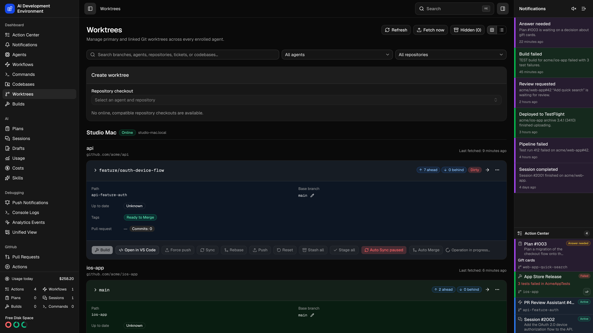

<p align="center">
  <picture>
    <source media="(prefers-color-scheme: dark)" srcset=".github/assets/logo-dark.svg">
    <source media="(prefers-color-scheme: light)" srcset=".github/assets/logo-light.svg">
    
  </picture>
</p>

<p align="center">A self-hosted control plane for AI-assisted development across your Macs.</p>

<p align="center">
  <a href="https://ai-development-environment.mintlify.app/">Documentation</a> ·
  <a href="https://ai-development-environment.mintlify.app/quickstart">Quickstart</a> ·
  <a href="https://ai-development-environment.mintlify.app/reference/development">Local development</a> ·
  <a href="https://github.com/bludesign/ai-development-environment/issues">Issues</a>
</p>

<p align="center">
  
</p>

## Documentation

Everything lives at **[ai-development-environment.mintlify.app](https://ai-development-environment.mintlify.app/)**.

| | |
| --- | --- |
| [Introduction](https://ai-development-environment.mintlify.app/) | What the product does and how the pieces fit together |
| [Quickstart](https://ai-development-environment.mintlify.app/quickstart) | Install via Homebrew, npm, or from source, and enroll an agent |
| [Local development](https://ai-development-environment.mintlify.app/reference/development) | Running from source, the command list, and the screenshot pipeline |
| [APIs](https://ai-development-environment.mintlify.app/reference/api) | GraphQL, the codebase REST endpoints, and MCP |
| [Database](https://ai-development-environment.mintlify.app/reference/database) | Prisma, migrations, and reclaiming space |
| [Hosting and networking](https://ai-development-environment.mintlify.app/reference/hosting) | Public HTTPS, Cloudflare Access, and reverse proxies |

The documentation source is in [`bludesign/ai-development-environment-docs`](https://github.com/bludesign/ai-development-environment-docs).

## Install

```bash
brew tap bludesign/ai-development-environment
brew install ai-development-environment
brew services start ai-development-environment
```

Or from npm:

```bash
npm install -g @ai-development-environment/server @ai-development-environment/control-agent
ai-development-environment
```

Full instructions, including enrolling a control agent, are in the [Quickstart](https://ai-development-environment.mintlify.app/quickstart).

## License

MIT. See [`LICENSE.md`](LICENSE.md).
